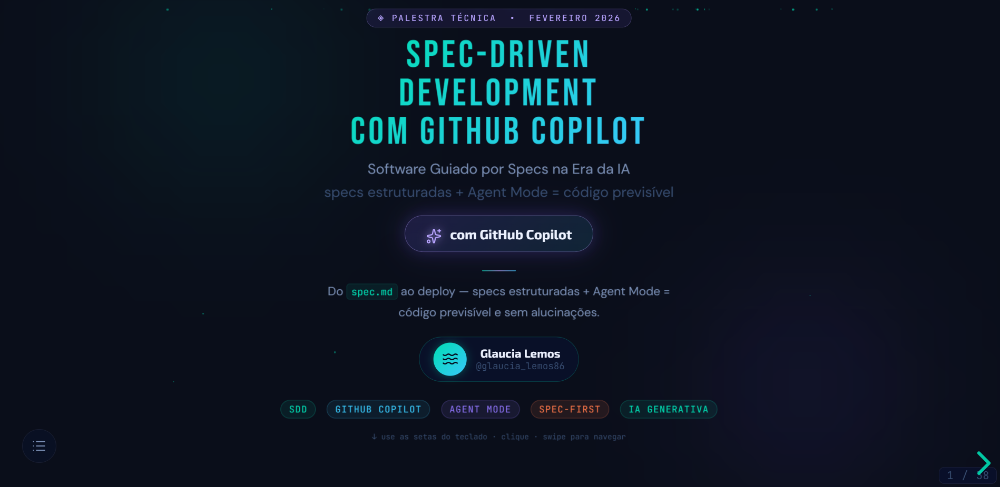

# SDD — Spec-Driven Development com GitHub Copilot



### Apresentação Web Interativa

> **Palestra técnica** sobre Spec-Driven Development (SDD) com GitHub Copilot, construída com Reveal.js.  
> Desenvolvida por **Glaucia Lemos** ([@glaucia_lemos86](https://x.com/glaucia_lemos86)) • Fevereiro 2026

---

## 🚀 Como Executar

### Opção 1 — Abrir diretamente no navegador (mais simples)

```bash
# No Windows — abra o index.html no Chrome ou Edge:
start index.html
```

> ⚠️ Os diagramas Mermaid e as fontes do Google precisam de internet (CDN).  
> Use a Opção 2 se preferir um servidor local completo.

### Opção 2 — Servidor local (recomendado)

```bash
# Com Python 3
python -m http.server 3000

# Com Node.js (npx)
npx serve .

# Com VS Code — Live Server
# Clique com botão direito em index.html → "Open with Live Server"
```

Acesse: **http://localhost:3000**

---

## 🎮 Navegação

| Ação | Como fazer |
|------|-----------|
| Próximo slide | → ou Espaço |
| Slide anterior | ← |
| Sub-slide abaixo/acima | ↓ / ↑ |
| Visão geral | Tecla ESC |
| Tela cheia | Tecla F |
| Notas do palestrante | Tecla S |

---

## 📁 Estrutura do Projeto

```
palestra-sdd/
├── index.html          ← Apresentação principal (todos os slides)
├── css/
│   └── custom.css      ← Tema dark tech customizado
├── js/
│   └── custom.js       ← Lógica: Reveal.js, Mermaid, Quiz, Partículas
├── docs/
│   ├── PRD.md          ← Documento de requisitos desta apresentação
│   └── prompt.md       ← Prompt original
└── README.md           ← Este arquivo
```

---

## 📊 Conteúdo da Apresentação

| # | Seção | Conteúdo |
|---|-------|----------|
| 1 | **Capa** | Título, autor, tags |
| 2 | **Sumário** | Navegação interativa (3×3) |
| 3 | **O que é SDD?** | Definição, problemas/soluções, benefícios |
| 4 | **Por que SDD Hoje?** | Contexto de AI assistants |
| 5 | **PRD.md** | Definição, estrutura, comparativo |
| 6 | **GitHub Copilot Chat** | Timeline, modos, modelos, features, Copilot+SDD |
| 7 | **Fluxo SDD** | Diagrama Mermaid + 4 passos detalhados |
| 8 | **Arquitetura de Contexto** | AGENTS.md, Rules, Skills.md |
| 9 | **Referências** | Links e fontes |
| 10 | **Conclusão** | Resumo + call to action |
| 11 | **Q&A / Quiz** | Quiz interativo com 3 questões |

---

## 🛠️ Tecnologias

| Tecnologia | Versão | Uso |
|-----------|--------|-----|
| [Reveal.js](https://revealjs.com) | 5.1.0 | Framework de slides |
| [Mermaid.js](https://mermaid.js.org) | 11.x | Diagramas de fluxo |
| Highlight.js | (via Reveal) | Syntax highlighting |
| Bebas Neue / Exo 2 / DM Sans / JetBrains Mono | Google Fonts | Tipografia |

---

## 🌐 Deploy no GitHub Pages

1. Push para um repositório GitHub
2. **Settings → Pages → Source:** branch `main`, pasta `/`
3. Acesse: `https://<usuario>.github.io/<repo>/`

---

## 📄 Licença

MIT — Uso livre para fins educativos e apresentações técnicas.

---

<p align="center">
  Feito com ❤️ por <strong>Glaucia Lemos</strong> &nbsp;|&nbsp;
  <a href="https://x.com/glaucia_lemos86">@glaucia_lemos86</a>
</p>
